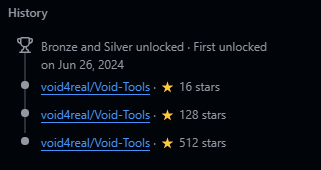

  

  

---

# ⚡ [ System Status: Operational ]
> **"Learning to become the best version of myself."**

* 🔴 **Focus:** Learning programming languages and pentesting.
* 💀 **Specialty:** Offensive Security & Advanced Pentesting.
* 📈 **Legacy:** Peak impact of **512 stars** on the *Void-Tools*.

---

# 🛠 Arsenal & Skills

  

---

# 🚀 Proven Impact

  

  

  <b>Historical Record: 512 ⭐ on Void-Tools (Verified)</b>

---

